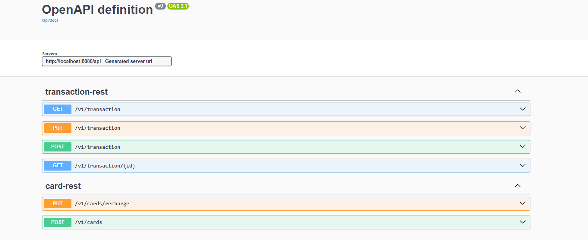
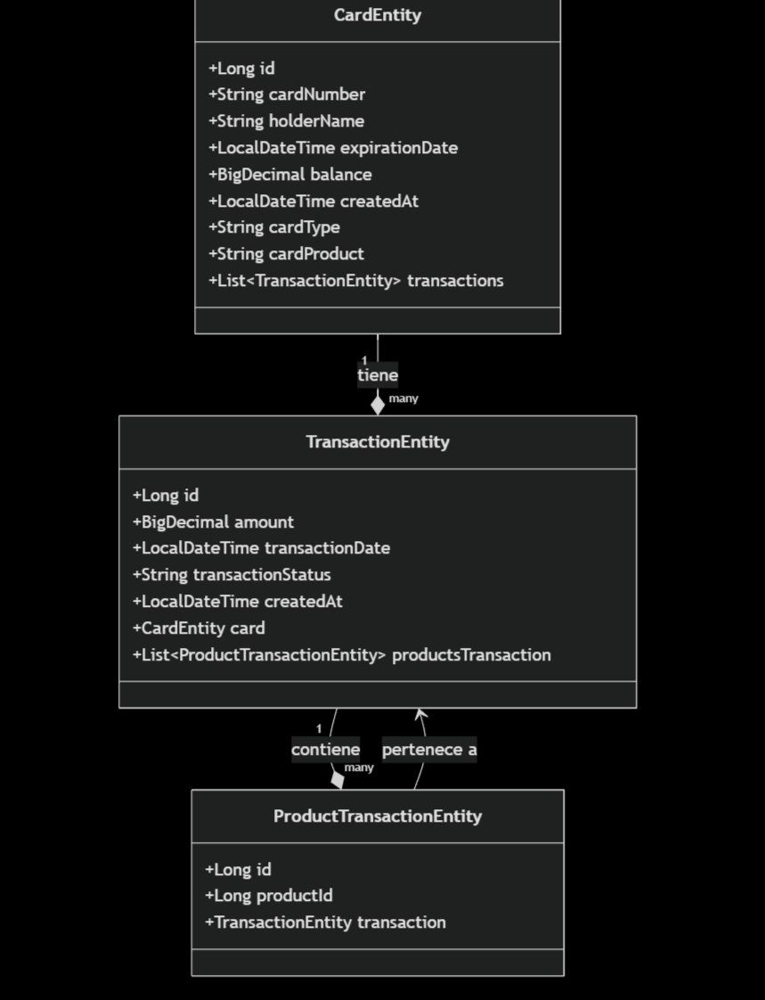
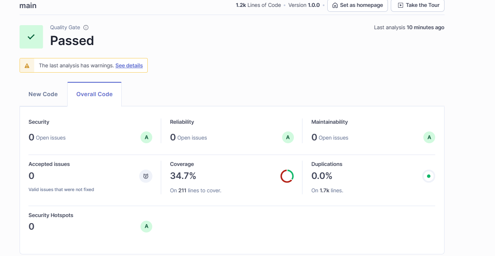

En este documento se describe el proyecto, su funcionalidad y las tecnologías utilizadas.

## 🔩Descripción del proyecto🔩

- API Sistema backend para la gestión de tarjetas y procesamiento de transacciones financieras, desarrollado bajo los
  principios de Arquitectura Hexagonal (Clean Architecture).


- Permite  : 
    - Creación de tarjetas con generación automática de números
    - Recarga de saldo en tarjetas existentes
    - Consulta de información por número de tarjeta
    - Validación de fecha de expiración

## Tecnologías

- [Java 21 (OpenJdk)](https://jdk.java.net/archive/)
- [Spring Boot](https://spring.io/projects/spring-boot)
- [Scaffolding Bancolombia](https://bancolombia.github.io/scaffold-clean-architecture/)
- [MapStruct](https://mapstruct.org/)
- [Lombok1](https://projectlombok.org/#)
- [SonarQube](https://www.sonarqube.org/)
- [Swagger (Springdoc OpenAPI)](https://springdoc.org/)
- [Docker](https://www.docker.com/)

## Ejecución de pruebas 🔬

- Es necesario contar con Java 21
    1. Dirigirse a la raíz del proyecto.
    2. Ejecutar el comando ./gradlew :usecase:test -x validateStructure --no-configuration-cache

## Datos

- Este proyecto utiliza una base de datos MYSQL.

## Endpoints de la API

- ### Crear Una Tarjeta

```http
  POST /cards
```

| Parameter      | Type     | Description  | Valores Permitidos                                   |
|:---------------|:---------|:-------------|:-----------------------------------------------------|
| `holder_name`  | `String` | **Required** | Cualquier                                            |
| `card_type`    | `String` | **Required** | `CREDITO`, `DEBITO`                                  |
| `card_product` | `String` | **Required** | `COLOMBIAN_EXPRESS`, `MONSTER_CARD`, `PASSPORT_CARD` |

#### Ejemplo de Solicitud:

```json
{
  "holder_name": "Steven Palacio",
  "card_type": "CREDITO",
  "card_product": "MONSTER_CARD"
}
```

#### Ejemplo de respuesta:

```json {
  {
  "data": {
    "id": 20,
    "card_number": "6543210454151324",
    "holder_name": "Steven Palacio",
    "expiration_date": "25-10-2028",
    "balance": 0.0,
    "card_type": "CREDITO",
    "card_product": "MONSTER_CARD"
  },
  "status": "200 OK",
  "message": "La operación se realizó exitosamente."
}
```

- ### Recargar Una Tarjeta

```http
  GET /cards/recharge
```

| Parameter     | Type     | Description  | Valores Permitidos |
|:--------------|:---------|:-------------|:-------------------|
| `amount`      | `Long`   | **Required** | superior a 0       |
| `card_number` | `String` | **Required** | Cualquier          |

#### Ejemplo de Soliciatud:

```json
{
  "card_number": "6543210454151324",
  "amount": 876.10
}
```

#### Ejemplo de Respuesta:

```json
{
  "data": {
    "cardNumber": "6543210454151324",
    "amount": 876.10
  },
  "status": "200 OK",
  "message": "La targeta No°  6543210454151324 fue recargada exitosamente, nuevo saldo: 876.10 usd."
}
```

- ### Crear Transacción

```http
  POST /transaction

```

| Parameter   | Type   | Description                                    |
|:------------|:-------|:-----------------------------------------------|
| `products ` | `List` | **Required**. Lista de  id de los productos    |
| `card`      | `Card` | **Required**.  Numero de la tarjeta de credito |

#### Ejemplo de Solicitud:

```json
{
  "products": [
    1,
    2
  ],
  "card": {
    "card_number": "6543210454151324"
  },
  "amount": 1
}
```

#### Ejemplo de respuesta:

```json
{
  "data": {
    "id": 19,
    "amount": 1,
    "transaction_date": "2025-10-26T00:07:58.1256546",
    "card": {
      "id": 20,
      "card_number": "6543210454151324",
      "holder_name": "Steven Palacio",
      "expiration_date": "2028-10-25T21:57:52.006421",
      "balance": 859.10,
      "card_type": "CREDITO",
      "card_product": "MONSTER_CARD"
    },
    "transaction_status": "EXITOSA",
    "products": [
      1,
      2
    ]
  },
  "status": "201 CREATED",
  "message": "La operación se realizó exitosamente."
}
  ```

- ### Editar Transacción

```http
  PUT /transaction
```

| Parameter             | Type     | Description  | Valores Permitidos |
|:----------------------|:---------|:-------------|:-------------------|
| `id`                  | `Long`   | **Required** | Cualquier          |
| `transaction_status ` | `String` | **Required** | `ANULADA`          |

#### Ejemplo de Solicitud:

```json
{
  "id": 19,
  "transaction_status": "ANULADA"
}
```

#### Ejemplo de respuesta:

```json
{
  "data": {
    "id": 20,
    "amount": 1.00,
    "transaction_date": "2025-10-26T00:17:00.159565",
    "card": {
      "id": 20,
      "card_number": "6543210454151324",
      "holder_name": "Steven Palacio",
      "expiration_date": "2028-10-25T21:57:52.006421",
      "balance": 860.10,
      "card_type": "CREDITO",
      "card_product": "MONSTER_CARD"
    },
    "transaction_status": "ANULADA",
    "products": [
      1,
      2
    ]
  },
  "status": "200 OK",
  "message": "La operación se realizó exitosamente."
}
  ```

- ### Obtener todas Transacciónes

```http
  Get /transaction
```

* Sin parametros

#### Ejemplo de respuesta:

```json
{
  "data": [
    {
      "id": 1,
      "amount": 1.00,
      "transaction_date": "2025-10-25T23:29:24.693168",
      "card": {
        "id": 20,
        "card_number": "6543210454151324",
        "holder_name": "Steven Palacio",
        "expiration_date": "2028-10-25T21:57:52.006421",
        "balance": 861.10,
        "card_type": "CREDITO",
        "card_product": "MONSTER_CARD"
      },
      "transaction_status": "ANULADA",
      "products": [
        1,
        2
      ]
    },
    {
      "id": 2,
      "amount": 1.00,
      "transaction_date": "2025-10-25T23:38:10.162099",
      "card": {
        "id": 20,
        "card_number": "6543210454151324",
        "holder_name": "Steven Palacio",
        "expiration_date": "2028-10-25T21:57:52.006421",
        "balance": 861.10,
        "card_type": "CREDITO",
        "card_product": "MONSTER_CARD"
      },
      "transaction_status": "EXITOSA",
      "products": [
        1,
        2
      ]
    },
    {
      "id": 3,
      "amount": 1.00,
      "transaction_date": "2025-10-25T23:38:34.311031",
      "card": {
        "id": 20,
        "card_number": "6543210454151324",
        "holder_name": "Steven Palacio",
        "expiration_date": "2028-10-25T21:57:52.006421",
        "balance": 861.10,
        "card_type": "CREDITO",
        "card_product": "MONSTER_CARD"
      },
      "transaction_status": "ANULADA",
      "products": [
        1,
        2
      ]
    },
    {
      "id": 4,
      "amount": 1.00,
      "transaction_date": "2025-10-25T23:39:11.011275",
      "card": {
        "id": 20,
        "card_number": "6543210454151324",
        "holder_name": "Steven Palacio",
        "expiration_date": "2028-10-25T21:57:52.006421",
        "balance": 861.10,
        "card_type": "CREDITO",
        "card_product": "MONSTER_CARD"
      },
      "transaction_status": "EXITOSA",
      "products": [
        1,
        2
      ]
    },
    {
      "id": 5,
      "amount": 1.00,
      "transaction_date": "2025-10-25T23:39:22.56199",
      "card": {
        "id": 20,
        "card_number": "6543210454151324",
        "holder_name": "Steven Palacio",
        "expiration_date": "2028-10-25T21:57:52.006421",
        "balance": 861.10,
        "card_type": "CREDITO",
        "card_product": "MONSTER_CARD"
      },
      "transaction_status": "ANULADA",
      "products": [
        1,
        2
      ]
    },
    {
      "id": 6,
      "amount": 1.00,
      "transaction_date": "2025-10-25T23:40:20.236073",
      "card": {
        "id": 20,
        "card_number": "6543210454151324",
        "holder_name": "Steven Palacio",
        "expiration_date": "2028-10-25T21:57:52.006421",
        "balance": 861.10,
        "card_type": "CREDITO",
        "card_product": "MONSTER_CARD"
      },
      "transaction_status": "ANULADA",
      "products": [
        1,
        2
      ]
    },
    {
      "id": 7,
      "amount": 1.00,
      "transaction_date": "2025-10-25T23:42:28.368897",
      "card": {
        "id": 20,
        "card_number": "6543210454151324",
        "holder_name": "Steven Palacio",
        "expiration_date": "2028-10-25T21:57:52.006421",
        "balance": 861.10,
        "card_type": "CREDITO",
        "card_product": "MONSTER_CARD"
      },
      "transaction_status": "ANULADA",
      "products": [
        1,
        2
      ]
    },
    {
      "id": 8,
      "amount": 1.00,
      "transaction_date": "2025-10-25T23:43:58.321832",
      "card": {
        "id": 20,
        "card_number": "6543210454151324",
        "holder_name": "Steven Palacio",
        "expiration_date": "2028-10-25T21:57:52.006421",
        "balance": 861.10,
        "card_type": "CREDITO",
        "card_product": "MONSTER_CARD"
      },
      "transaction_status": "ANULADA",
      "products": [
        1,
        2
      ]
    },
    {
      "id": 9,
      "amount": 1.00,
      "transaction_date": "2025-10-25T23:45:52.066279",
      "card": {
        "id": 20,
        "card_number": "6543210454151324",
        "holder_name": "Steven Palacio",
        "expiration_date": "2028-10-25T21:57:52.006421",
        "balance": 861.10,
        "card_type": "CREDITO",
        "card_product": "MONSTER_CARD"
      },
      "transaction_status": "ANULADA",
      "products": [
        1,
        2
      ]
    },
    {
      "id": 10,
      "amount": 1.00,
      "transaction_date": "2025-10-25T23:47:59.951076",
      "card": {
        "id": 20,
        "card_number": "6543210454151324",
        "holder_name": "Steven Palacio",
        "expiration_date": "2028-10-25T21:57:52.006421",
        "balance": 861.10,
        "card_type": "CREDITO",
        "card_product": "MONSTER_CARD"
      },
      "transaction_status": "ANULADA",
      "products": [
        1,
        2
      ]
    }
  ],
  "status": "200 OK",
  "message": "La operación se realizó exitosamente."
}
  ```

- ### Obtener Transacción por Id

```http
  PUT /transaction/{id}
```

#### Ejemplo de respuesta:

```json
{
  "data": {
    "id": 20,
    "amount": 1.00,
    "transaction_date": "2025-10-26T00:17:00.159565",
    "card": {
      "id": 20,
      "card_number": "6543210454151324",
      "holder_name": "Steven Palacio",
      "expiration_date": "2028-10-25T21:57:52.006421",
      "balance": 861.10,
      "card_type": "CREDITO",
      "card_product": "MONSTER_CARD"
    },
    "transaction_status": "ANULADA",
    "products": [
      1,
      2
    ]
  },
  "status": "200 OK",
  "message": "La operación se realizó exitosamente."
}
  ```

## Uso de swagger


Para acceder a la documentación de la API, puedes utilizar Swagger. La URL por defecto es:

```
http://localhost:8080/api/swagger.html
```

## Diagrama de Clases-Entitys



## Manejo de Errores

- La API cuenta con un manejo de errores global con @RestControllerAdvice, que captura excepciones y las devuelve con
  ResponseHelper, para mantener un formato uniforme incluso en las respuestas de error.

## Resultados SonarQube


